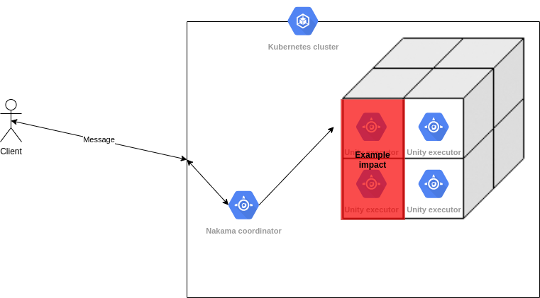

# niwrad


See related writings:

* [Blog post part one](https://medium.com/swlh/a-simulation-of-evolution-part-one-62a1acfb009a)

## How it works

[Nakama](https://github.com/heroiclabs/nakama) is used for network communication, kubernetes coordination & other stuffs.

### Architecture

Simulate physics is hard. Unity does it decently.  
It's easier to just use Unity for that instead of the Nakama server.



Under the hood Nakama is used as a coordinator to spawn kubernetes pods that handle each a specific box of the map.  
An Octree data structure is used for that.  


### Features & direction

* Hosts (any life form) have characteristics.
* Hosts can reproduce (sexual only atm), when they do, their characteristics are "mixed" plus a slight randomness (mutation).
* Hosts behaviour code MUST be generic, so we can either implement simple heuristics like state-machines, behaviour trees or more complex like reinforcement learning.
* Hosts will evolve by natural selection, some characteristics that help survival (speed ... ?) will increase, some that harm survival will decrease.
* Players can trigger artificial selection, e.g. like we human selected the cows that produce the most milk, the goal is to implement actions that offer the possibility to influence evolution. Currently what came to my mind: any way to protect, harm, heal, feed ... some targeted hosts (high speed hosts ? big hosts ...)

## Usage

```bash
git clone https://github.com/louis030195/niwrad
```

### Prerequisites

#### Deployment

1. [Docker](https://www.docker.com)
2. [Install kubectl](https://kubernetes.io/docs/tasks/tools/install-kubectl/)
3. [Install helm](https://helm.sh/docs/intro/install/)
4. [Install minikube](https://kubernetes.io/docs/tasks/tools/install-minikube/) (for local k8s)

#### Client

1. [Unity](https://unity.com)
2. make: `sudo apt install make`
3. [protoc, protoc-gen-go, protoc-gen-csharp](https://github.com/protocolbuffers/protobuf) (optional)

```make
Usage: make [TARGET]
Targets:
  build                 build unity client, docker images and protobufs
  build-client          build unity client
  build-server          build unity server
  build-images          build docker images
  build-proto           build protobuf stubs
  deploy                deploy cluster
  un-deploy             un-deploy cluster
  client                launch Linux client
```

So you can try by deploying cluster & runnning client:

```bash
make deploy
make client
```

### TODO

* [ ] [Medium] Unit testing some client-side physics like Vector3.PositionAboveGround()
* [ ] [Hard] Mock test Nakama (rpcs, hooks ...), Kubernetes (rpcs that spawn k8s stuff are hand tested, not safe), real lack of testing, at least can split into small functions that can be tested.
* [ ] [Easy] Implement "robot": a creature that will tweak evolution according to our will, e.g. "I want fast animals" it will kill all slow animals\
    Basically anything that can allow players to apply artificial selection
* [ ] [Easy] finish github workflow (github page deployment)
* [ ] [Easy] Android controller
* [ ] [Easy] Deploy persistent, resilient, fenced server on the cloud
* [ ] [Medium] Consider adding predators / parasites in order to trigger competition e.g. Red Queen hypothesis
* [ ] [Medium] [JS client](https://www.npmjs.com/package/@heroiclabs/nakama-js) for bots ?
